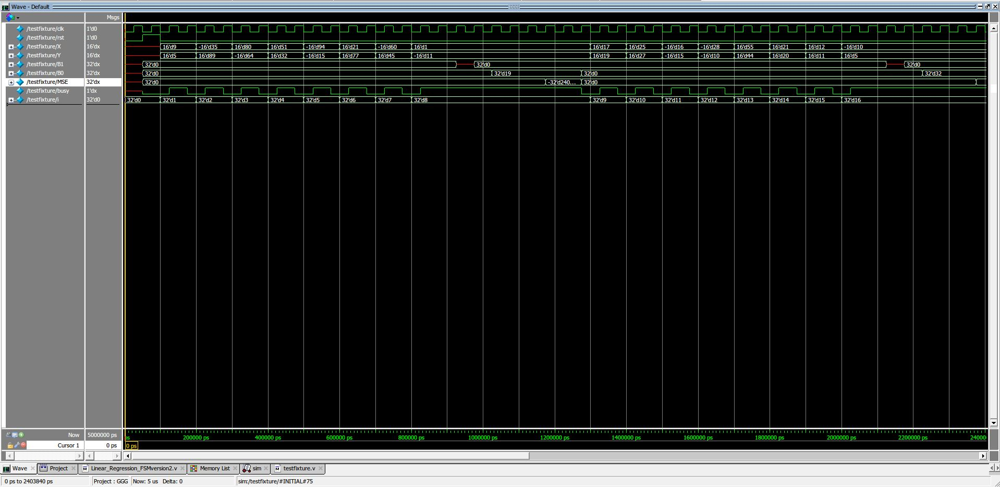

# **研究所課程 : 超大型積體電路訊號處理架構設計**
---

這個課主要教我們ㄧ些訊號處理的演算法，要怎麼轉化成硬體架構，

包含 pipelining、parallel processing、retiming、folding、unfolding 等等

有大概4個作業，前三個都是用 Matlab 寫，最後一個當做期末專題，也就是這個

---

[程式碼](Linear_Regression.v)：**DSP / Linear_Regression.v**

[TestBench](LR_testbench.v)：**DSP / LR_testbench.v**

最後的結果：

